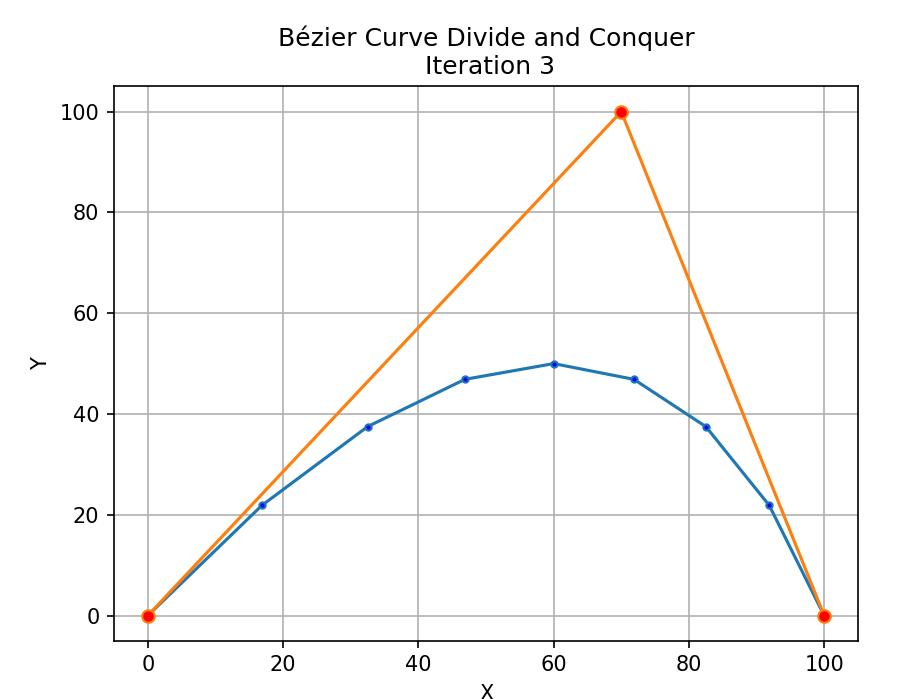
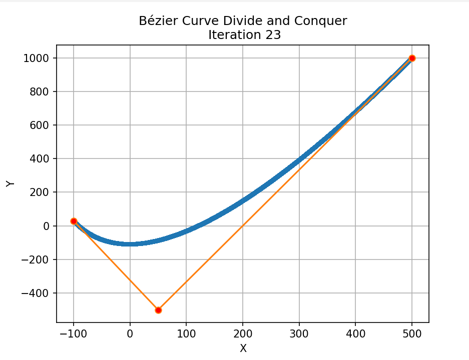
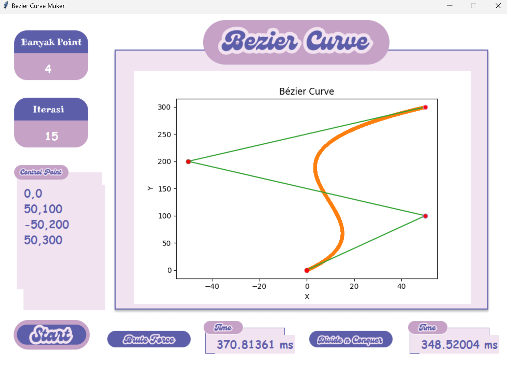
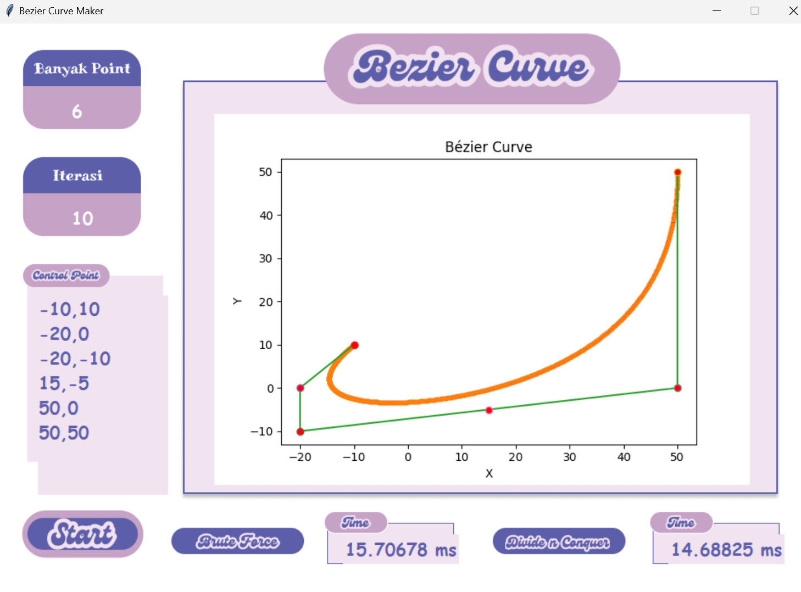

# Tugas Kecil 2 IF2211 Strategi Algoritma   Semester II tahun 2023/2024   
## Membangun Kurva Bézier dengan Algoritma Titik Tengah berbasis Divide and Conquer

> This program is created to fulfill the second small assignment of the IF2211 Algorithmic Strategy course with the aim of understanding the implementation of the Divide and Conquer Algorithm in forming Bezier Curves.

## Authors 

<table style="width:100%; background-color:#87CEFA; color:#F0F8FF;">
  <tr>
    <th>Nama</th>
    <th>NIM</th>
  </tr>
  <tr>
    <td>Marzuli Suhada M</td>
    <td>13522070</td>
  </tr>
  <tr>
    <td>Keanu Amadius Gonza Wrahatno</td>
    <td>13522082</td>
  </tr>
</table>

## Table of Contents
* [General Info](#general-information)
* [Features](#features)
* [Screenshots](#screenshots)
* [Usage](#usage)
* [Project Status](#project-status)
* [Contact](#contact)

## General Information
In this assignment, the main issue to be addressed is the formation of Quadratic Bézier Curve. The objective of this task is to visualize the curve resulting from points determined using the Divide and Conquer Algorithm approach. Additionally, this task will also involve the generalization of the algorithm so that it can solve the problem of forming Bézier Curves from n points. In this small assignment, a brute force algorithm is utilized as a benchmark to be compared in terms of complexity and validity of the solution.

## Features
- Dapat membentuk Kurva Bezier dengan N titik > 2
- Dapat memvisualisasikan Kurva

## Screenshots

## Usage
Jika ingin menggunakan CLI  
`python main.py`  
 
Jika ingin menggunakan GUI  
`python gui.py`

## Project Status
Project is:  _complete_ 

## Contact
13522070@mahasiswa.itb.ac.id (Marzuli Suhada M)  
13522082@mahasiswa.itb.ac.id (Keanu Amadius Gonza W.)
